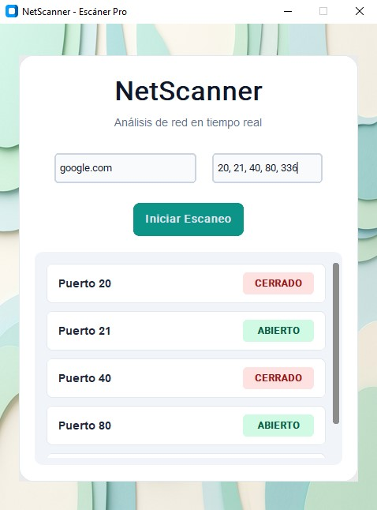

# NetScanner - Escáner de Puertos y Red

NetRecon es una herramienta de ciberseguridad y diagnóstico de red desarrollada en Python. Permite auditar la disponibilidad de puertos específicos en direcciones IP o dominios mediante el uso de sockets TCP, facilitando la detección de vulnerabilidades o configuraciones de firewall.

## Características principales
- **Escaneo Multihilo:** Implementación de `threading` para evitar el bloqueo de la interfaz gráfica durante escaneos intensivos o de alta latencia.
- **Diagnóstico TCP Nativo:** Utiliza la librería `socket` de bajo nivel para establecer conexiones directas y evaluar la respuesta del objetivo.
- **Interfaz Moderna y Fluida:** Interfaz gráfica minimalista construida con `CustomTkinter` y `Pillow`, diseñada bajo el estándar de tarjetas flotantes (Floating Card UI).
- **Manejo de Excepciones:** Resolución automática de dominios y protección contra entradas de usuario inválidas.

## Tecnologías utilizadas
- **Python 3.x**
- **Networking:** `socket` (TCP/IP).
- **Frontend:** `CustomTkinter`, `Pillow`.
- **Concurrencia:** `threading`.

## Instalación y Uso
1. Clona este repositorio:
## Vista Previa

   ```bash
   git clone [https://github.com/tu-usuario/netrecon-scanner.git](https://github.com/tu-usuario/netrecon-scanner.git)
